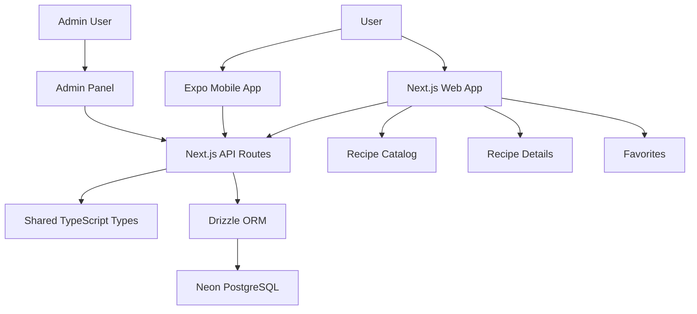

# 🍽️ Chefo’s Recipes — Full-stack Recipe Catalog Platform

<p align="left">
  <a href="https://github.com/s-badev/chefos-recipes-fullstack">
    
  </a>
  
</p>

<p align="left">
  
  
  
  
  
  
  
  
  
</p>

**Chefo’s Recipes** is a full-stack, multi-platform recipe catalog application developed as a SoftUni capstone project for the **Full Stack Apps with AI** course.

The project is designed as a practical recipe platform where users can browse recipes, view detailed cooking instructions, save favorites, and use both a responsive web application and a mobile client. Admin users will be able to manage recipe content through a dedicated web admin panel.

---

## 🧭 Architecture Overview



---

## 📌 Project Status

**Current phase:** Full-stack foundation in active development.

The application currently works with **static/sample data** while the database and API layers are being prepared for real Neon PostgreSQL integration.

The goal is to turn the project into a database-backed full-stack recipe platform with authentication, role-based access, favorites, and admin recipe management.

---

## ✅ Completed Foundation Work

- ✅ GitHub repository setup with visible incremental commit history
- ✅ AI agent / contributor instructions
- ✅ Project documentation and environment variable documentation
- ✅ Root npm workspace configuration
- ✅ Next.js web app scaffold with verified dependencies
- ✅ Expo mobile app scaffold with verified dependencies
- ✅ Bulgarian web UI foundation:
  - Homepage
  - Recipe catalog
  - Recipe details pages
  - Favorites placeholder
  - Admin panel placeholder
- ✅ Initial Expo mobile screens using local state and static sample data
- ✅ Shared TypeScript types package
- ✅ Database package skeleton
- ✅ Drizzle schema draft
- ✅ Drizzle migration setup
- ✅ Initial generated SQL migration
- ✅ Database client skeleton prepared for future Neon connection
- ✅ Initial Next.js API route skeleton
- ✅ Static recipe data layer used by recipe-related API routes
- ✅ API endpoint documentation with example responses
- ✅ Stable Git save points / tags for rollback safety

---

## 🚧 Upcoming Work

- 🔌 Connect the application to Neon PostgreSQL
- 🗄️ Replace static recipe data with Drizzle ORM queries
- 🔐 Add authentication with JWT access / refresh tokens
- 🛡️ Add role-based access control for user/admin flows
- ⭐ Implement real favorites functionality
- 🧑‍🍳 Add admin create/edit/delete recipe actions
- 🚀 Deploy the production web app
- 🧪 Add broader testing and final documentation polish

---

## 🎯 Development Approach

The project is intentionally developed step by step to keep the architecture clean, the Git history readable, and the implementation realistic for a student capstone project.

The focus is on:

- practical full-stack architecture
- AI-assisted development workflow
- clean project structure
- reusable TypeScript types
- web + mobile direction
- database-backed application design
- professional documentation

---

## 🎯 Project Goals

The goal of this project is to build a complete full-stack application with:

- 🌐 a **Next.js web application** for desktop and mobile browsers
- ⚙️ a **Next.js backend API** used as the server-side layer
- 🐘 a **PostgreSQL database** hosted with Neon
- 🧱 database access through **Drizzle ORM** and migrations
- 📱 an **Expo React Native mobile app**
- 🔐 user authentication with **JWT tokens**
- 🛡️ role-based access control for regular users and admin users
- 🧑‍🍳 a small but functional admin panel
- 📚 clean documentation and visible GitHub development history

---

## 🧰 Planned Tech Stack

| Layer | Technology |
|---|---|
| 🌐 Web app | Next.js, React, TypeScript, Tailwind CSS |
| ⚙️ Backend API | Next.js API routes / route handlers |
| 🗄️ Database | Neon PostgreSQL |
| 🧱 ORM | Drizzle ORM + migrations |
| 📱 Mobile app | React Native with Expo |
| 🔐 Authentication | JWT access/refresh tokens |
| 🛡️ Authorization | User/admin roles |
| 🎨 Styling | Tailwind CSS, responsive design |
| 🤖 Development workflow | VS Code, Codex / GitHub Copilot, GitHub |

---

## 🗂️ Monorepo Structure

The project uses a monorepo structure with separate folders for the web app, mobile app, shared types and database layer.

### Apps

- `apps/web` — Next.js web application and backend API route handlers
- `apps/mobile` — Expo React Native mobile application

### Packages

- `packages/db` — Drizzle schema, migrations and database client skeleton
- `packages/shared` — shared TypeScript types, DTOs and future validators/utilities

### Documentation

- `docs/architecture.md` — high-level architecture and data flow
- `docs/database-schema.md` — planned database tables and relationships
- `docs/api-endpoints.md` — current and planned API endpoints
- `docs/environment.md` — environment variable usage and safety notes

### Root Files

- `AGENTS.md` — AI agent and contributor guidelines
- `README.md` — project overview and progress documentation
- `.env.example` — safe placeholder environment variables

---

## 🖥️ Web App Screens

The current web app foundation includes:

| Screen | Status |
|---|---|
| 🏠 Homepage | ✅ Static UI implemented |
| 📖 Recipe Catalog | ✅ Static UI implemented |
| 🍲 Recipe Details | ✅ Static UI implemented |
| ⭐ Favorites | ✅ Placeholder UI implemented |
| 🛠️ Admin Panel | ✅ Placeholder UI implemented |

The visible web UI is primarily in **Bulgarian**, because the project is focused on Bulgarian-style recipes and should feel natural for its target users.

---

## 📱 Mobile App Screens

The Expo mobile app currently includes an initial local-state UI foundation:

| Screen | Status |
|---|---|
| 📋 Recipes | ✅ Static UI implemented |
| 🍽️ Recipe Details | ✅ Static UI implemented |
| ⭐ Favorites / Profile | ✅ Placeholder UI implemented |

The mobile app currently uses local static data and will later connect to the same backend API used by the web app.

---

## ⚙️ API Routes

The project currently includes an initial API skeleton using static/sample data.

| Method | Route | Current Purpose |
|---|---|---|
| GET | `/api/health` | Basic API health check |
| GET | `/api/recipes` | Returns sample recipe list |
| GET | `/api/recipes/[slug]` | Returns one sample recipe by slug |
| GET | `/api/categories` | Returns sample categories |
| GET | `/api/favorites` | Returns placeholder favorite recipes |
| GET | `/api/admin/summary` | Returns placeholder admin dashboard stats |

These routes will later be connected to **Drizzle ORM**, **Neon PostgreSQL**, authentication, and role-based access control.

---

## 🗄️ Database Foundation

The database layer currently includes:

- ✅ `packages/db` package
- ✅ Drizzle schema draft
- ✅ Drizzle migration setup
- ✅ Initial generated SQL migration
- ✅ Database client skeleton
- ✅ Environment variable documentation

Planned core tables include:

- `users`
- `categories`
- `tags`
- `recipes`
- `recipe_steps`
- `recipe_tags`
- `favorites`

---

## 🔐 Environment Variables

Required environment variable placeholders are documented in `.env.example`.

Planned variables:

| Variable | Purpose |
|---|---|
| `DATABASE_URL` | Future Neon PostgreSQL connection string for Drizzle/database tooling |
| `JWT_SECRET` | Future JWT access token signing secret |
| `JWT_REFRESH_SECRET` | Future JWT refresh token signing secret |
| `NEXT_PUBLIC_APP_URL` | Public base URL for the web app |

Real secrets must **never** be committed.

More details are available in:

```text
docs/environment.md
```

---

## 🧪 Current Data Strategy

At the current stage, the app uses **static/sample recipe data**.

This allows the project to develop and validate:

- UI structure
- page flow
- API response shape
- recipe catalog behavior
- mobile screen structure
- future database model alignment

Later, this static data layer will be replaced with real **Drizzle + Neon** database queries.

---

## 🧭 Development Workflow

The project is developed incrementally:

1. Define a small task.
2. Implement it with AI-assisted coding tools.
3. Review the changed files.
4. Run the relevant checks.
5. Commit with a clear message.
6. Push to GitHub.
7. Continue with the next small step.

This keeps the project easier to control and creates a visible development history for assessment.

---

## 🏷️ Stable Save Points

The project uses Git tags as rollback points.

Current save points:

```text
stable-foundation-v1
stable-ui-mobile-db-v1
```

These tags mark stable stages of the project and can be used as safe rollback references if later work breaks the application.

---

## 📚 Documentation

| File | Purpose |
|---|---|
| `docs/architecture.md` | High-level system architecture and data flow |
| `docs/database-schema.md` | Planned database tables and relationships |
| `docs/api-endpoints.md` | Current and planned REST API endpoints |
| `docs/environment.md` | Environment variable usage and safety notes |
| `AGENTS.md` | Instructions for AI coding agents and contributors |

---

## 📦 Current Project Scope

This project is intentionally scoped as a realistic student capstone.

The current goal is not to overbuild, but to deliver a clean, understandable, multi-layer application with:

- working web UI
- working mobile UI foundation
- documented API structure
- planned database model
- generated migration
- clean Git history
- clear next development steps

---

## 🚀 Planned Next Steps

1. Connect API routes to a repository/service layer.
2. Set up real Neon PostgreSQL connection.
3. Replace static recipe data with Drizzle queries.
4. Implement authentication.
5. Add user favorites with real persistence.
6. Add admin create/edit/delete recipe functionality.
7. Connect the mobile app to the backend API.
8. Deploy the web app.
9. Finalize documentation and screenshots.

---

## 👤 Author

**Stefan Badev**

---

## 📄 License

This project is created for educational purposes as part of a SoftUni capstone assignment.
