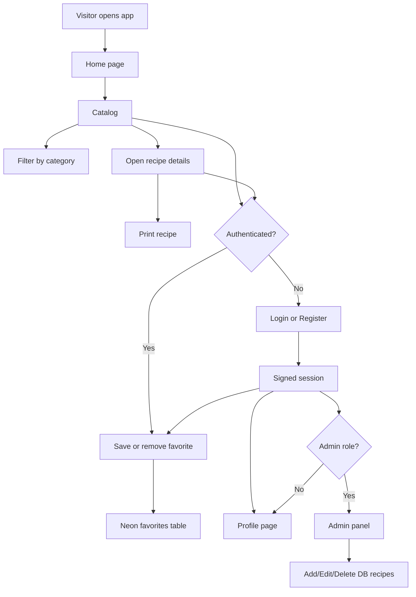
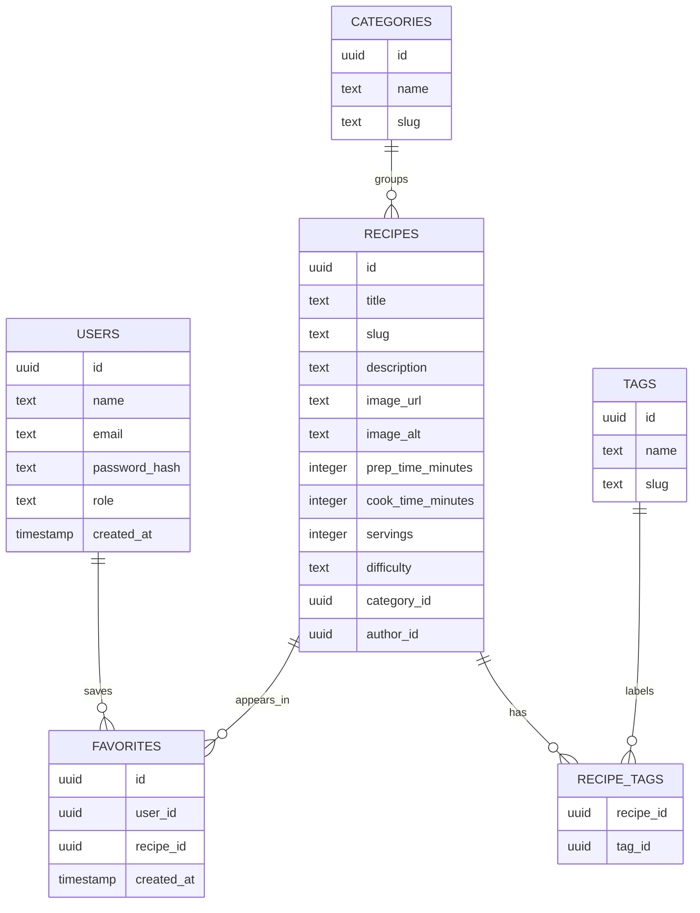

# 🍽️ Chefo’s Recipes — Full-Stack Bulgarian Recipe Catalog

<p>
  <a href="https://chefos-recipes.netlify.app">
    
  </a>
  <a href="https://chefos-recipes-mobile.netlify.app">
    
  </a>
</p>

[](https://nextjs.org/)
[](https://react.dev/)
[](https://www.typescriptlang.org/)
[](https://tailwindcss.com/)
[](https://neon.tech/)
[](https://orm.drizzle.team/)
[](https://expo.dev/)
[](#authentication-and-authorization)
[](https://www.netlify.com/)
[](#project-status)

**Chefo’s Recipes** is a deployed full-stack Bulgarian recipe catalog built with **Next.js**, **React**, **TypeScript**, **Neon PostgreSQL**, **Drizzle ORM**, and **Expo React Native**.

The project includes a production **Next.js web app + backend**, a deployed **Expo mobile web export**, real authentication, user-specific favorites, role-based admin access, database-backed recipe management, seeded scalability data, and REST API endpoints consumed by the mobile client.

This repository was developed as a SoftUni **Full Stack Apps with AI** capstone project and is structured as a production-style npm workspace monorepo.

---

## 🌐 Live Demo

| Platform               | URL                                       |
| ---------------------- | ----------------------------------------- |
| Web App + Backend API  | https://chefos-recipes.netlify.app        |
| Expo Mobile Web Export | https://chefos-recipes-mobile.netlify.app |

---

## 🔑 Review Access

Demo accounts are available for reviewer testing.

| Role  | Email                     | Password     | What you can test                                  |
| ----- | ------------------------- | ------------ | -------------------------------------------------- |
| User  | `user@chefos-recipes.bg`  | `user12345`  | Catalog, recipe details, favorites, profile        |
| Admin | `admin@chefos-recipes.bg` | `admin12345` | Full user flow + protected admin recipe management |

Regular users do **not** see the Admin navigation item and should not be able to access admin-only areas manually.

---

## ✨ Highlights

* 🍲 **Bulgarian recipe catalog** with home-style meals, rich cards, real images, timing, servings, tags, and difficulty levels.
* 🗂️ **24 curated public recipes** organized into a polished user-facing catalog.
* 🔎 **Public browsing experience** with home page, catalog, category filtering, and recipe details.
* ❤️ **Real user favorites** stored in Neon PostgreSQL.
* 🔐 **Authentication** with database-backed users, hashed passwords, signed web sessions, and JWT-based mobile API auth.
* 👋 **Personalized user experience** with user name in the header and profile page.
* 🛡️ **Role-based access** with protected admin-only pages.
* 🧑‍🍳 **Database-backed admin panel** with DB totals, limited management list, and add/edit/delete recipe actions.
* 🌍 **Manual admin-created recipes are saved in PostgreSQL and displayed in both the admin panel and the public catalog, while generated scalability records stay hidden from the public catalog.
* 🖼️ **Fallback images** for admin-created recipes without custom uploads.
* 🗄️ **Neon PostgreSQL + Drizzle ORM** database layer.
* 🌱 **10,000+ generated records** for scalability and database/admin testing.
* 📱 **Expo React Native mobile app** deployed as a Netlify web export.
* 🔌 **REST API endpoints** used by the mobile client.
* 🚀 **Separate Netlify deployments** for web/backend and mobile web export.

---

## 🧭 Application Flow


```mermaid
flowchart TD
  A[Visitor opens app] --> B[Home page]
  B --> C[Catalog]
  C --> D[Filter by category]
  C --> E[Open recipe details]
  E --> F[Print recipe]
  C --> G{Authenticated?}
  E --> G
  G -- No --> H[Login or Register]
  H --> I[Signed session]
  G -- Yes --> J[Save or remove favorite]
  I --> J
  J --> K[Neon favorites table]
  I --> L[Profile page]
  I --> M{Admin role?}
  M -- Yes --> N[Admin panel]
  N --> O[Add/Edit/Delete DB recipes]
  M -- No --> L
```

---

## 📋 Project Description

**Chefo’s Recipes** focuses on practical Bulgarian home cooking.

The web app provides a curated recipe catalog with rich cards, detailed recipe pages, authentication, favorites, profile experience, and a protected admin panel. The backend uses Next.js route handlers, Neon PostgreSQL, Drizzle ORM, and secure authentication flows.

The Expo mobile app consumes the deployed Next.js REST API and provides a mobile-first recipe browsing, login, profile, and favorites experience.

The user-facing UI is Bulgarian-first, while the codebase and documentation remain English-friendly for technical review.

---

## 🖥️ Implemented Web Screens

* Home
* Catalog
* Category filtering
* Recipe details
* Favorites
* Profile
* Login
* Register
* About
* Admin dashboard
* Admin recipe management
* Add recipe page
* Edit recipe page

---

## 📱 Implemented Mobile Screens

The Expo mobile app is included under `apps/mobile` and is deployed as a web export.

* Home
* Catalog
* Recipe details
* Favorites
* Login
* Register
* Profile

Mobile deployment:

```text
https://chefos-recipes-mobile.netlify.app
```

The mobile app connects to the deployed Next.js REST API:

```text
https://chefos-recipes.netlify.app/api/mobile
```

---

## 🚀 Key Features

### 🍲 Public Recipe Catalog

* 24 polished curated recipes form the base public catalog.
* Bulgarian recipe categories.
* Category filtering.
* Recipe cards with images, category badges, difficulty badges, timing, servings, and tags.
* Save/remove favorite action for authenticated users.
* Manual admin-created recipes are added to the public catalog after being saved through the admin panel.
* Generated scalability records are intentionally hidden from the public catalog.

### 🧑‍🍳 Recipe Details

* Dedicated detail page for each public recipe.
* Recipe image, title, description, timing, difficulty, and servings.
* Products / ingredients list.
* Step-by-step preparation instructions.
* Working **“Запази в любими”** action.
* Working **“Принтирай рецепта”** action using browser print.
* Graceful fallback text for admin-created recipes without full ingredients/steps.

### 🔐 Authentication

* User registration persists users in Neon PostgreSQL.
* Passwords are hashed with `scrypt`.
* Login works for demo accounts and registered users.
* Signed web session flow with HTTP-only cookie.
* JWT-based auth for mobile API flows.
* Header displays the logged-in user’s name.
* Profile page displays personalized user information.

### ❤️ Favorites

* Favorites are stored in Neon PostgreSQL.
* Favorites are user-specific.
* Users can add and remove favorites from catalog, detail, and favorites pages.
* Favorite records are linked to users and recipe slugs/IDs.
* Mobile app supports favorites through the deployed REST API.

### 🛡️ Admin Panel

* Admin role exists.
* Admin navigation is visible only for admin users.
* Admin dashboard shows database-backed statistics.
* Admin panel shows DB totals/counts and a limited management list from the database.
* Admin can add recipes.
* Admin can edit database-backed recipes.
* Admin can delete database-backed recipes.
* Manually added admin recipes are displayed in the public catalog after being saved through the admin panel.
* Admin-created recipes without uploaded images use fallback recipe imagery.

### 🌱 Seed and Scalability

* Seed script lives in `packages/db`.
* Core visible recipes are upserted by stable slug.
* Categories and tags are seeded.
* 10,000+ generated recipe records support scalability testing.
* Generated records remain available for database/admin testing.
* Generated records are intentionally hidden from the public catalog to keep UX fast and polished.

---

## 🗂️ Catalog & Data Strategy

The project separates the **public user experience** from the **database scalability layer**.

| Area                          | Behavior                                                                             |
| ----------------------------- | ------------------------------------------------------------------------------------ |
| Public catalog                | Shows the curated 24-recipe base plus manually added admin recipes                   |
| Manual admin recipes          | Saved in PostgreSQL and displayed publicly after being created in the admin panel    |
| Generated scalability records | Stored in Neon PostgreSQL but hidden from the public catalog                         |
| Admin panel                   | Shows DB totals/counts and a limited database management list                        |
| Mobile API                    | Uses the deployed Next.js REST API                                                   |

This keeps the public catalog lightweight and polished while still demonstrating database-backed admin management and large dataset handling.

---

## 🗂️ Recipe Categories

The public curated catalog contains 24 polished recipes across the main Bulgarian recipe categories.

| Category                  | Curated public recipes |
| ------------------------- | ---------------------: |
| Салати                    |                      4 |
| Тестени                   |                      4 |
| Основни                   |                      4 |
| Супи                      |                      4 |
| Бързи ястия               |                      4 |
| Десерти                   |                      4 |
| **Total curated recipes** |                 **24** |

Manual admin-created recipes are added to the public catalog and can increase the visible recipe count and category results beyond the curated 24-recipe base.

---

## 👤 User Roles

| Role    | Access                                                                       |
| ------- | ---------------------------------------------------------------------------- |
| Visitor | Home, catalog, recipe details, login, and registration                       |
| User    | Visitor access plus profile and user-specific favorites                      |
| Admin   | User access plus protected admin panel and database-backed recipe management |

---

## 🏗️ Architecture

```text
chefos-recipes-fullstack/
|-- apps/
|   |-- web/
|   |   |-- src/app/              # Next.js App Router pages, UI and API routes
|   |   |-- src/data/             # Curated public catalog data
|   |   |-- src/server/           # Auth, favorites, recipes and server-side logic
|   |   |-- src/lib/              # Shared web utilities
|   |   `-- public/images/        # Recipe and background assets
|   |
|   `-- mobile/
|       |-- src/screens/          # Expo mobile screens
|       |-- src/components/       # Mobile UI components
|       |-- src/services/         # Mobile REST API client
|       |-- src/context/          # Mobile auth/session context
|       `-- App.tsx               # Expo app root
|
|-- packages/
|   |-- db/                       # Drizzle schema, migrations, seed script and DB client
|   `-- shared/                   # Shared TypeScript utilities/types
|
|-- docs/
|-- AGENTS.md
|-- README.md
`-- package.json
```

---

## 🧰 Technology Stack

| Layer                 | Technology                                                    |
| --------------------- | ------------------------------------------------------------- |
| Web framework         | Next.js App Router                                            |
| UI                    | React, TypeScript, Tailwind CSS, global CSS                   |
| Backend               | Next.js route handlers and Server Actions                     |
| Mobile                | Expo React Native, React Native Web                           |
| Database              | Neon PostgreSQL                                               |
| ORM                   | Drizzle ORM                                                   |
| Web authentication    | Signed sessions, HTTP-only cookies, `scrypt` password hashing |
| Mobile authentication | JWT-based API auth with `MOBILE_JWT_SECRET`                   |
| Deployment            | Netlify                                                       |
| Package management    | Node.js and npm workspaces                                    |

---

## 🔌 API Overview

The mobile client uses REST API endpoints from the deployed Next.js app.

Base API:

```text
https://chefos-recipes.netlify.app/api/mobile
```

| Endpoint                       | Purpose                           |
| ------------------------------ | --------------------------------- |
| `/api/mobile/health`           | Mobile API health check           |
| `/api/mobile/categories`       | Category listing                  |
| `/api/mobile/recipes`          | Paginated recipe catalog          |
| `/api/mobile/recipes/[slug]`   | Recipe details                    |
| `/api/mobile/auth/login`       | Mobile login                      |
| `/api/mobile/auth/register`    | Mobile registration               |
| `/api/mobile/auth/me`          | Current authenticated mobile user |
| `/api/mobile/favorites`        | User favorites                    |
| `/api/mobile/favorites/[slug]` | Remove favorite by recipe slug    |

CORS support is enabled for the deployed mobile web export.

---

## 🔐 Authentication and Authorization

Authentication is implemented with database-backed users, signed web sessions, and JWT-based mobile API flows.

* Registered users are stored in the Neon `users` table.
* Passwords are stored as hashes, not plaintext.
* Password hashing uses `scrypt`.
* Login supports demo accounts and registered database users.
* Web sessions are signed and stored in an HTTP-only cookie.
* Mobile API authentication uses JWT.
* The `role` field supports `user` and `admin`.
* Regular users can access profile and favorites.
* Admin users can access the admin panel.
* Secrets are configured through environment variables and are not committed.

---

## ❤️ Favorites

Favorites are real database-backed records.

* A favorite links a user to a recipe.
* Recipe matching uses stable slugs.
* Each user sees only their own saved recipes.
* Save/remove is supported from catalog cards, recipe detail pages and the favorites page.
* Mobile favorites are handled through the deployed REST API.

---

## 🗃️ Database Schema Design


```mermaid
erDiagram
  USERS ||--o{ FAVORITES : saves
  RECIPES ||--o{ FAVORITES : appears_in
  CATEGORIES ||--o{ RECIPES : groups
  RECIPES ||--o{ RECIPE_TAGS : has
  TAGS ||--o{ RECIPE_TAGS : labels

  USERS {
    uuid id
    text name
    text email
    text password_hash
    text role
    timestamp created_at
  }

  CATEGORIES {
    uuid id
    text name
    text slug
  }

  RECIPES {
    uuid id
    text title
    text slug
    text description
    text image_url
    text image_alt
    integer prep_time_minutes
    integer cook_time_minutes
    integer servings
    text difficulty
    uuid category_id
    uuid author_id
  }

  FAVORITES {
    uuid id
    uuid user_id
    uuid recipe_id
    timestamp created_at
  }

  TAGS {
    uuid id
    text name
    text slug
  }

  RECIPE_TAGS {
    uuid recipe_id
    uuid tag_id
  }
```

---

## 📈 Seed and Scalability

Run the seed script:

```powershell
npm.cmd run seed --workspace packages/db
```

Seed behavior:

* Upserts the core curated recipes by stable slug.
* Inserts or upserts required categories and tags.
* Keeps the visible catalog compatible with favorites.
* Generates 10,000+ additional recipe records for scalability testing.
* Keeps generated records available in the database/admin layer.
* Prevents generated records from flooding the public catalog.
* Supports pagination and large dataset testing.

---

## 🖼️ Assets

| Asset type        | Location                             |
| ----------------- | ------------------------------------ |
| Recipe images     | `apps/web/public/images/recipes`     |
| Background images | `apps/web/public/images/backgrounds` |

Image upload is intentionally not implemented. Admin-created recipes without custom images use fallback recipe imagery.

---

## 🚀 Local Development Setup

Install dependencies:

```powershell
npm install
```

Start the web app:

```powershell
npm.cmd run dev --workspace apps/web
```

Build the web app:

```powershell
npm.cmd run build --workspace apps/web
```

Seed the database:

```powershell
npm.cmd run seed --workspace packages/db
```

Start the Expo mobile app locally:

```powershell
cd apps/mobile
npx expo start --clear --lan
```

Build the Expo mobile web export:

```powershell
npm.cmd run build --workspace @chefos/mobile
```

---

## 🔧 Environment Variables

Use placeholders only in committed files.

### Web / Backend

```env
DATABASE_URL=
JWT_TOKEN=
JWT_SECRET=
MOBILE_JWT_SECRET=
```

`DATABASE_URL` should point to the Neon PostgreSQL production database.

`JWT_TOKEN`, `JWT_SECRET`, and `MOBILE_JWT_SECRET` should be long random secret values configured in the hosting provider.

### Mobile Web Export

```env
EXPO_PUBLIC_API_BASE_URL=https://chefos-recipes.netlify.app
```

The mobile app does not connect directly to the database. It communicates with the REST API exposed by the deployed Next.js app.

Never commit real `.env` files or secrets.

---

## 🌍 Deployment

### Web App + Backend

| Setting           | Value                                                          |
| ----------------- | -------------------------------------------------------------- |
| Platform          | Netlify                                                        |
| Project name      | `chefos-recipes`                                               |
| Live URL          | https://chefos-recipes.netlify.app                             |
| Project to deploy | `apps/web`                                                     |
| Build command     | `npm --workspace @chefos/web run build`                        |
| Publish directory | `apps/web/.next`                                               |
| Database          | Neon PostgreSQL                                                |
| Required env vars | `DATABASE_URL`, `JWT_TOKEN`, `JWT_SECRET`, `MOBILE_JWT_SECRET` |

### Expo Mobile Web Export

| Setting           | Value                                                         |
| ----------------- | ------------------------------------------------------------- |
| Platform          | Netlify                                                       |
| Project name      | `chefos-recipes-mobile`                                       |
| Live URL          | https://chefos-recipes-mobile.netlify.app                     |
| Project to deploy | `apps/mobile`                                                 |
| Build command     | `npm --workspace @chefos/mobile run build`                    |
| Publish directory | `apps/mobile/dist`                                            |
| Required env var  | `EXPO_PUBLIC_API_BASE_URL=https://chefos-recipes.netlify.app` |

---

## 🧪 Quick Test Guide

1. Open the deployed web app:

   ```text
   https://chefos-recipes.netlify.app
   ```

2. Open the deployed mobile web export:

   ```text
   https://chefos-recipes-mobile.netlify.app
   ```

3. Confirm the live mobile API returns JSON:

   ```text
   https://chefos-recipes.netlify.app/api/mobile/recipes
   ```

4. Log in as a regular user:

   ```text
   user@chefos-recipes.bg
   user12345
   ```

5. Save and remove a recipe from favorites.

6. Log in as admin:

   ```text
   admin@chefos-recipes.bg
   admin12345
   ```

7. Open `/admin` and confirm:

   * Admin DB count/list loads.
   * Add recipe works.
   * Edit recipe works.
   * Delete recipe works.
   * Manual admin-created recipe is displayed in the public catalog after being saved through the admin panel.
   * Generated scalability records stay hidden from the public catalog.

8. Open the Expo mobile web export and confirm:

   * Home screen loads.
   * Catalog loads.
   * Recipe details open.
   * Login works.
   * Profile opens.
   * Favorites work.

---

## 🧪 Testing Checklist

* Web app opens.
* Public catalog opens.
* Category filters work.
* Recipe details open.
* User login works.
* Favorites work.
* Profile opens.
* Admin login works.
* Admin DB count/list loads.
* Admin add recipe works.
* Admin edit recipe works.
* Admin delete recipe works.
* Manual admin-created recipe is displayed in the public catalog.
* Generated scalability records stay hidden from public catalog.
* Mobile web export opens.
* Mobile catalog loads.
* Mobile login works.
* Mobile profile works.
* Mobile favorites work.

---

## ✅ Project Status

| Item                                             | Status          |
| ------------------------------------------------ | --------------- |
| Next.js web app                                  | Done / Deployed |
| Backend API                                      | Done / Deployed |
| Bulgarian recipe catalog                         | Done            |
| 24 curated public recipes                        | Done            |
| Manual admin-created recipes displayed publicly  | Done            |
| Category filtering                               | Done            |
| Recipe detail pages                              | Done            |
| Print recipe action                              | Done            |
| Registration and login                           | Done            |
| Hashed passwords                                 | Done            |
| Signed web sessions                              | Done            |
| JWT mobile API auth                              | Done            |
| User-specific favorites                          | Done            |
| Admin role and admin panel                       | Done            |
| Database-backed admin management                 | Done            |
| Admin add/edit/delete                            | Done            |
| Generated scalability records hidden publicly    | Done            |
| Neon PostgreSQL integration                      | Done            |
| Drizzle ORM schema/seed                          | Done            |
| 10,000+ generated records for scalability        | Done            |
| Expo mobile app                                  | Done            |
| Expo mobile web export deployment                | Done            |
| CORS support for mobile API calls                | Done            |
| Netlify web/backend deployment                   | Done            |
| Netlify mobile deployment                        | Done            |

---

## 🧾 Submission Information

| Field                 | Value                                                          |
| --------------------- | -------------------------------------------------------------- |
| Project               | Chefo’s Recipes                                                |
| Type                  | Full-stack Bulgarian recipe catalog with web and mobile client |
| Author                | Stefan Badev                                                   |
| Email                 | [stefan.badev@yahoo.com](mailto:stefan.badev@yahoo.com)        |
| GitHub Repo           | https://github.com/s-badev/chefos-recipes-fullstack            |
| Web Project Live URL  | https://chefos-recipes.netlify.app                             |
| Expo Project Live URL | https://chefos-recipes-mobile.netlify.app                      |
| Database              | Neon PostgreSQL with Drizzle ORM                               |
| Deployment            | Netlify                                                        |

---

## ⚠️ Notes

* The Expo mobile app is deployed as a web export, as required for the project submission.
* The mobile web export uses the deployed Next.js REST API.
* Image upload is intentionally not implemented.
* Admin-created recipes without custom images use fallback images.
* Recipes without full ingredients/steps use graceful fallback text where needed.
* Generated scalability records are not shown publicly by design.
* Browser print previews may show browser-generated headers and footers unless disabled in browser print settings.
* This project is built as a capstone and portfolio-ready full-stack application with production-style architecture, while intentionally keeping some commercial-grade features, such as image upload infrastructure, outside the project scope.
* Supporting screenshots are included for Netlify environment variables, Neon PostgreSQL tables, and the deployed Expo mobile web export. Sensitive values such as secrets, tokens and database URLs are hidden or masked.
* Visible names and emails in database screenshots are fictional demo/test records used only for seeding and testing. They do not represent real users.
  
---

## 🎯 Conclusion

Chefo’s Recipes is a deployed full-stack Bulgarian recipe catalog with a working Next.js web app, backend API, Neon PostgreSQL database, Drizzle ORM integration, authentication, favorites, admin access, database-backed recipe management, and Expo mobile web export.

The project demonstrates a complete full-stack workflow: database modeling, seeding, backend API design, web UI, mobile UI, authentication, role-based access, deployment, and AI-assisted development.

Built by **Stefan Badev** as a capstone and portfolio-ready full-stack application.
