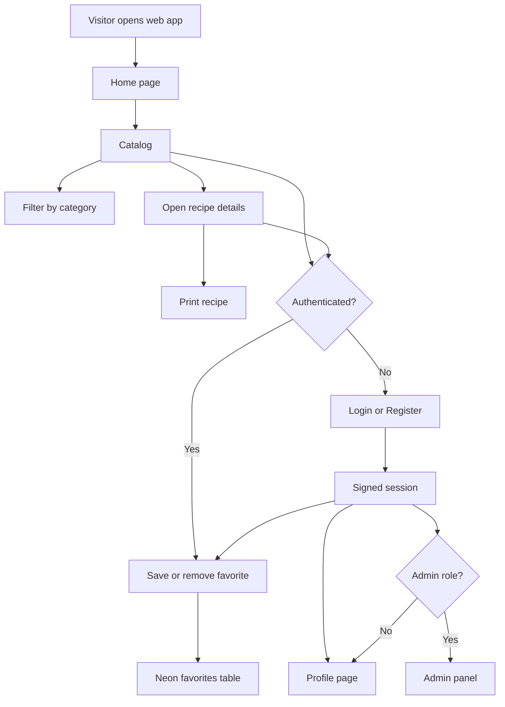
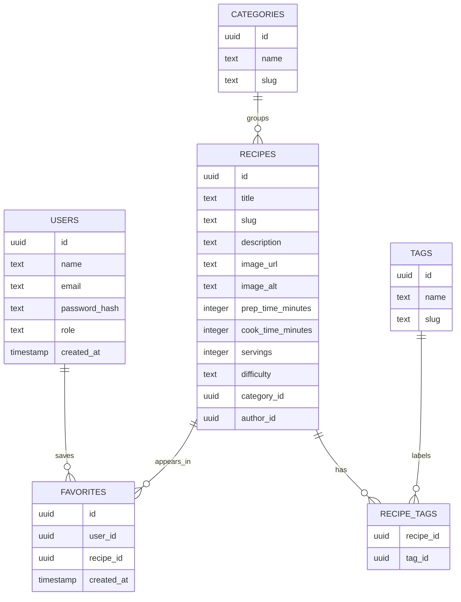

# 🍽️ Chefo’s Recipes

[](https://nextjs.org/)
[](https://react.dev/)
[](https://www.typescriptlang.org/)
[](https://tailwindcss.com/)
[](https://neon.tech/)
[](https://orm.drizzle.team/)
[](#project-status)

**Chefo’s Recipes** is a Bulgarian homemade recipe catalog built with **Next.js**, **React**, **TypeScript**, **Neon PostgreSQL** and **Drizzle ORM**.

The app delivers a polished Bulgarian-first recipe browsing experience with real registration and login, user-specific favorites, role-based admin access, detailed recipe pages, printable recipes and seeded database content.

The project is structured as a full-stack npm workspace and is suitable for SoftUni project review and GitHub portfolio presentation.

---

## ✨ Highlights

| Area | Current state |
|---|---|
| Catalog | 24 visible Bulgarian recipes |
| Categories | 6 balanced categories with 4 recipes each |
| Recipe details | Images, metadata, ingredients, preparation steps and quick actions |
| Favorites | Real user-specific favorites stored in Neon PostgreSQL |
| Authentication | Registration, login, hashed passwords and signed sessions |
| Admin | Admin role and admin panel for authorized users |
| Seed data | Core visible recipes plus 10,000 generated recipes for scalability testing |
| Print | Browser print dialog for recipe detail pages |

---

## 🌐 Live Demo

Deployment: **Coming soon**

The application is currently intended to be reviewed locally with a seeded Neon PostgreSQL database.

---

## 🔑 Review Access

Demo accounts are available for reviewer testing. New users can also register directly through the app.

| Role | Email | Password | What you can test |
|---|---|---|---|
| User | `user@chefos-recipes.bg` | `user12345` | Catalog, recipe details, favorites and profile |
| Admin | `admin@chefos-recipes.bg` | `admin12345` | Full user access + admin panel |

Regular users do **not** see the Admin navigation item and should not be able to access admin-only areas manually.

---

## 🧭 Application Flow


```mermaid
flowchart TD
  A[Visitor opens web app] --> B[Home page]
  B --> C[Catalog]
  C --> D[Filter by category]
  C --> E[Open recipe details]
  E --> F[Print recipe]
  C --> G{Authenticated?}
  E --> G
  G -- No --> H[Login or Register]
  H --> I[Signed session]
  G -- Yes --> J[Save or remove favorite]
  I --> J
  J --> K[Neon favorites table]
  I --> L[Profile page]
  I --> M{Admin role?}
  M -- Yes --> N[Admin panel]
  M -- No --> L
```

---

## 📋 Project Description

**Chefo’s Recipes** focuses on practical Bulgarian home cooking.

The web app provides a curated visible catalog with balanced categories, rich recipe cards, detailed recipe pages and a real favorites workflow backed by Neon PostgreSQL.

The app is Bulgarian-first for user-facing content, while the codebase and documentation remain English-friendly for review and collaboration.

---

## 🚀 Key Features

### 🍲 Recipe Catalog

- 24 visible recipes in the web catalog
- 6 categories with exactly 4 visible recipes each
- Category filtering
- Recipe cards with real images, category badges and difficulty badges
- Prep time, cook time, servings and tags on catalog cards
- Save/remove favorite action directly from recipe cards

### 🧑‍🍳 Recipe Details

- Dedicated detail page for each visible recipe
- Recipe image, title, description and cooking metadata
- Products / ingredients list
- Step-by-step preparation instructions
- Working **“Запази в любими”** action
- Working **“Принтирай рецепта”** action using the browser print dialog

### 🔐 Authentication

- User registration persists users in Neon PostgreSQL
- Passwords are hashed with `scrypt`
- Login works for demo accounts and registered users
- Signed session flow with HTTP-only session cookie
- Header displays the logged-in user’s name
- Profile page displays personalized user information

### ❤️ Favorites

- Favorites are stored in Neon PostgreSQL
- Favorites are user-specific
- Users can add and remove favorites from catalog, detail and favorites pages
- Favorites use stable recipe slugs that match seeded database records

### 🛡️ Admin

- Admin role exists
- Admin panel is available for admin users
- Regular users should not see or access admin-only areas
- Admin views include recipe overview and category/tag information

### 🌱 Seed and Scalability

- Seed script lives in `packages/db`
- Core visible recipes are upserted by slug
- Categories and tags are seeded
- 10,000 generated recipe records support scalability testing
- Fake favorites are disabled by default unless explicitly enabled

---

## 🗂️ Recipe Categories

The catalog is balanced for a clean four-card desktop grid.

| Category | Visible recipes |
|---|---:|
| Салати | 4 |
| Тестени | 4 |
| Основни | 4 |
| Супи | 4 |
| Бързи ястия | 4 |
| Десерти | 4 |
| **Total** | **24** |

---

## 👤 User Roles

| Role | Access |
|---|---|
| Visitor | Home, catalog, recipe detail pages, login and registration |
| User | Visitor access plus profile and user-specific favorites |
| Admin | User access plus admin panel and admin-only overview pages |

---

## 🖥️ Application Screens

- Home
- Catalog
- Recipe details
- Favorites
- Profile
- Login
- Register
- Admin

---

## 🧪 Quick Test Guide

1. Seed the database.

   ```powershell
   npm.cmd run seed --workspace packages/db
   ```

2. Start the web app.

   ```powershell
   npm.cmd run dev --workspace apps/web
   ```

3. Open the catalog and confirm each category contains 4 recipes.
4. Register a new user or log in with the review credentials.
5. Save a recipe from the catalog.
6. Open `/favorites` and confirm the recipe appears.
7. Remove the recipe from favorites and confirm it disappears.
8. Open a recipe detail page and click **“Принтирай рецепта”**.
9. Log in as an admin user to review the admin panel.

---

## 🖼️ Screenshots

Screenshots can be added for review and portfolio presentation.

| Screen | Suggested capture |
|---|---|
| Home | Landing page with Bulgarian visual identity |
| Catalog | 24-recipe grid and category filters |
| Recipe details | Image, ingredients, steps and quick actions |
| Favorites | User-specific saved recipes |
| Profile | Personalized logged-in user page |
| Admin | Admin-only overview |

---

## 🏗️ Architecture

```text
chefos-recipes-fullstack/
|-- apps/
|   |-- web/
|   |   |-- src/app/              # Next.js App Router pages and UI
|   |   |-- src/data/             # Visible catalog recipe data
|   |   |-- src/server/           # Auth, favorites and server-side logic
|   |   `-- public/images/        # Recipe and background assets
|   `-- mobile/                   # Expo mobile foundation
|-- packages/
|   |-- db/                       # Drizzle schema, migrations and seed script
|   `-- shared/                   # Shared TypeScript utilities/types
|-- docs/
|-- README.md
`-- package.json
```

The implemented review scope is the **Next.js web app**. The monorepo also includes an Expo mobile foundation, but mobile functionality is intentionally described conservatively.

---

## 🧰 Technology Stack

| Layer | Technology |
|---|---|
| Web framework | Next.js App Router |
| UI | React, TypeScript, Tailwind CSS and global CSS |
| Database | Neon PostgreSQL |
| ORM | Drizzle ORM |
| Authentication | Server-side auth helpers, `scrypt` password hashes and signed sessions |
| Package management | Node.js and npm workspaces |
| Mobile foundation | Expo / React Native package in the monorepo |

---

## 🔌 API Overview

The project keeps API and server-side boundaries available for web and mobile growth.

| Area | Purpose |
|---|---|
| Recipe data | Catalog and recipe detail data |
| Categories | Category listing and filtering support |
| Favorites | User-specific save/remove behavior |
| Auth/session | Registration, login and signed session handling |
| Admin | Admin-only overview and management screens |

The web app primarily uses Next.js server-side logic and Server Actions where appropriate.

---

## 🔐 Authentication and Authorization

Authentication is implemented in the web app.

- Registered users are stored in the Neon `users` table.
- Passwords are stored as hashes, not plaintext.
- Password hashing uses `scrypt`.
- Login supports demo accounts and registered database users.
- Sessions are signed and stored in an HTTP-only cookie.
- The `role` field supports `user` and `admin`.
- Regular users can access profile and favorites.
- Admin users can access the admin panel.

Secrets must be provided through environment variables and must not be committed.

---

## ❤️ Favorites

Favorites are real database-backed records.

- A favorite links a user to a recipe.
- Recipe matching uses stable slugs.
- The visible catalog slugs match the seeded Neon recipe slugs.
- Each user sees only their own saved recipes.
- Save/remove is supported from catalog cards, recipe detail pages and the favorites page.

---

## 🗃️ Database Schema Design


```mermaid
erDiagram
  USERS ||--o{ FAVORITES : saves
  RECIPES ||--o{ FAVORITES : appears_in
  CATEGORIES ||--o{ RECIPES : groups
  RECIPES ||--o{ RECIPE_TAGS : has
  TAGS ||--o{ RECIPE_TAGS : labels

  USERS {
    uuid id
    text name
    text email
    text password_hash
    text role
    timestamp created_at
  }

  CATEGORIES {
    uuid id
    text name
    text slug
  }

  RECIPES {
    uuid id
    text title
    text slug
    text description
    text image_url
    text image_alt
    integer prep_time_minutes
    integer cook_time_minutes
    integer servings
    text difficulty
    uuid category_id
    uuid author_id
  }

  FAVORITES {
    uuid id
    uuid user_id
    uuid recipe_id
    timestamp created_at
  }

  TAGS {
    uuid id
    text name
    text slug
  }

  RECIPE_TAGS {
    uuid recipe_id
    uuid tag_id
  }
```

---

## 📈 Seed and Scalability

Run the seed script:

```powershell
npm.cmd run seed --workspace packages/db
```

Seed behavior:

- Upserts the core visible recipes by stable slug.
- Inserts or upserts required categories and tags.
- Keeps the visible catalog compatible with favorites.
- Generates 10,000 additional recipe records for scalability testing.
- Uses generated records without replacing the curated visible catalog.
- Does not seed fake favorites by default unless explicitly enabled.

---

## 🖼️ Assets

| Asset type | Location |
|---|---|
| Recipe images | `apps/web/public/images/recipes` |
| Background image | `apps/web/public/images/backgrounds` |

---

## 🚀 Local Development Setup

Install dependencies:

```powershell
npm install
```

Start the web app:

```powershell
npm.cmd run dev --workspace apps/web
```

Build the web app:

```powershell
npm.cmd run build --workspace apps/web
```

Seed the database:

```powershell
npm.cmd run seed --workspace packages/db
```

---

## 🔧 Environment Variables

A local `.env` file is required for database-backed features.

Use placeholders only:

```env
DATABASE_URL=
AUTH_SESSION_SECRET=
NEXT_PUBLIC_APP_URL=
```

`DATABASE_URL` should point to a Neon PostgreSQL database. `AUTH_SESSION_SECRET` should be a local or deployment-specific secret value and must not be committed.

---

## 🌍 Deployment

Deployment status: **Coming soon**

Recommended production direction:

| Part | Suggested platform |
|---|---|
| Web app | Vercel / Netlify / another Next.js-compatible host |
| Database | Neon PostgreSQL |
| Environment | Production `.env` variables configured in the host dashboard |

---

## ✅ Project Status

| Item | Status |
|---|---|
| Next.js web app | Done |
| Bulgarian recipe catalog | Done |
| 24 visible recipes | Done |
| Balanced categories | Done |
| Recipe detail pages | Done |
| Print recipe action | Done |
| Registration and login | Done |
| Hashed passwords | Done |
| Signed sessions | Done |
| User-specific favorites | Done |
| Admin role and admin panel | Done |
| Neon seed script | Done |
| 10,000 generated recipe records | Done |
| Production deployment | Coming soon |
| Expo mobile app | Foundation present |

---

## 🧾 Submission Information

| Field | Value |
|---|---|
| Project | Chefo’s Recipes |
| Type | Full-stack recipe catalog |
| Author | Stefan Badev |
| Email | stefan.badev@yahoo.com |
| GitHub Repo | https://github.com/s-badev/chefos-recipes-fullstack |
| Review scope | Functional Next.js web application |
| Database | Neon PostgreSQL with Drizzle ORM |
| Web Project Live URL | Coming soon |
| Expo Project Live URL | Coming soon |

---

## ⚠️ Known Limitations

- Deployment URL is not available yet.
- The Expo mobile app is a foundation in the wider monorepo, not the primary reviewed production scope.
- Browser print previews may show browser-generated headers and footers, including localhost URLs, unless disabled in the browser print settings.
- The project is built for capstone evaluation and portfolio presentation, not hardened production SaaS operation.

---

## 🎯 Conclusion

Chefo’s Recipes is a functional full-stack Bulgarian recipe catalog with real authentication, database-backed favorites, role-based admin access, printable recipe pages and seeded data for both curated browsing and scalability testing.

The project is designed to be practical, reviewable and portfolio-ready, while keeping the user-facing experience focused on familiar Bulgarian home cooking.

Created by **Stefan Badev** as part of a SoftUni full-stack / AI-assisted development capstone project.
