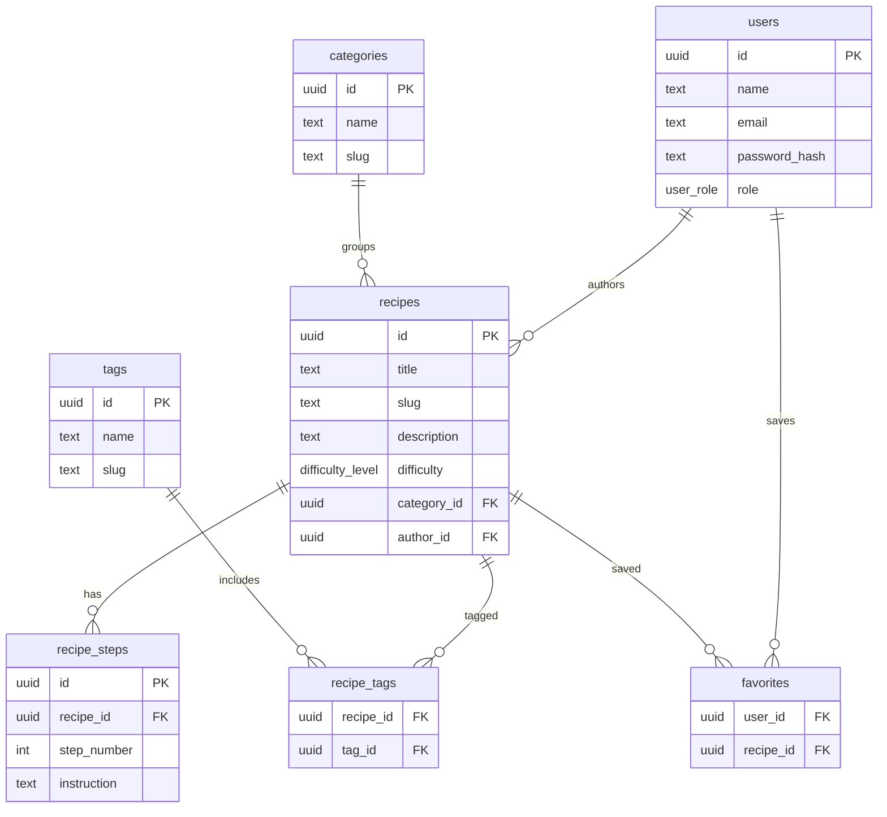

# Chefo's Recipes


Chefo's Recipes is a full-stack, multi-platform recipe catalog application developed as a SoftUni capstone project. It combines a Next.js web app, API routes, Server Actions, Neon PostgreSQL, Drizzle ORM, role-based demo authentication, protected admin features, and an Expo mobile foundation.

The product UI is intentionally Bulgarian-first. The app is built around Bulgarian/home-style cooking, so the visible interface uses Bulgarian labels and copy while the repository documentation is written in English for GitHub and portfolio review.

## Live Demo

| Platform | URL |
|---|---|
| Web App | Coming soon |
| Expo Web / Mobile Preview | Coming soon |

## Sample Credentials

The following demo accounts are available for testing. No registration is required for reviewer testing.

| Role | Email | Password | What you'll see |
|---|---|---|---|
| User | `user@chefos-recipes.bg` | `user12345` | Catalog, recipe details, favorites, profile. No "Admin" link; admin routes are denied. |
| Admin | `admin@chefos-recipes.bg` | `admin12345` | Full user access + "Admin" link; protected admin panel with add/edit/delete recipe actions. |

Regular users do not see the Admin navigation item and cannot access admin routes manually.

## Project Description

Chefo's Recipes is a recipe catalog for Bulgarian and home-style cooking. Visitors can browse the public homepage, open the recipe catalog, and view recipe details. Authenticated users get user-only navigation, a personalized header greeting, favorites/profile areas, and logout. Admins get a protected dashboard and recipe management actions.

The project is database-backed through Neon PostgreSQL and Drizzle ORM. The database package includes schema, migrations, a Neon client, and deterministic seed logic that can generate 10,000 recipes for scalability and pagination testing.

The repository also includes an Expo React Native mobile foundation as part of the multi-platform capstone scope. The mobile app is a preview/foundation companion rather than a fully polished production mobile client.

## Key Features

### Public Features

- Homepage
- Recipe catalog
- Recipe detail pages
- Category/tag-based browsing foundation
- Responsive premium food-site UI
- Bulgarian product interface

### User Features

- Login/logout
- Personalized greeting in the header
- Favorites area
- Profile area
- User-only navigation
- Admin link hidden for non-admin users

### Admin Features

- Admin-only navigation item
- Protected admin dashboard
- Add recipe
- Edit recipe
- Delete recipe
- Server-side admin guards for pages, actions, and API mutations

### Database & Backend Features

- Neon PostgreSQL
- Drizzle ORM
- Database schema and migrations
- Database client package
- Seed script
- 10,000 recipe dataset generation
- Paginated recipe API
- Protected API/admin actions

### Mobile Foundation

- Expo React Native project
- Mobile companion structure
- Local Expo development support
- Recipe list/details/category/favorites/profile preview states

## User Roles

| Role | Access |
|---|---|
| Guest | Can browse public pages and log in/register. |
| User | Can access catalog, recipe details, favorites and profile. Cannot see or access Admin. |
| Admin | Has full user access plus protected admin panel and recipe management actions. |

## Application Screens

1. Home Page
2. Catalog
3. Recipe Details
4. Favorites
5. Profile
6. Login
7. Register
8. Admin Dashboard
9. Add Recipe
10. Edit Recipe
11. About Page
12. Mobile App Preview / Expo Foundation

## Quick Test Guide

1. Open the web app.
2. Browse the public homepage and catalog.
3. Open a recipe details page.
4. Log in as regular user:
   - `user@chefos-recipes.bg`
   - `user12345`
5. Verify that:
   - "Любими" and "Профил" are visible.
   - "Админ" is not visible.
   - `/admin` cannot be accessed manually.
6. Log out.
7. Log in as admin:
   - `admin@chefos-recipes.bg`
   - `admin12345`
8. Verify that:
   - "Админ" is visible.
   - Admin dashboard opens.
   - Add/edit/delete recipe actions are available.
9. Check the paginated API:
   - `/api/recipes?page=1&pageSize=12`
10. Start the mobile app locally if needed:
   - `npm.cmd run start --workspace apps/mobile`

## Screenshots

_Add screenshots before final submission._

Suggested screenshots:

- Homepage
- Catalog
- Recipe details
- User login state
- Admin dashboard
- Admin edit recipe
- Mobile preview

## Architecture

```text
chefos-recipes-fullstack/
|-- apps/
|   |-- web/
|   |   |-- src/app/
|   |   |-- src/server/
|   |   `-- ...
|   `-- mobile/
|-- packages/
|   |-- db/
|   `-- shared/
|-- docs/
|-- README.md
`-- package.json
```

| Path | Purpose |
|---|---|
| `apps/web` | Next.js web app, App Router pages, API routes, Server Actions, auth-aware header, protected admin UI |
| `apps/mobile` | Expo React Native app foundation for the mobile companion experience |
| `packages/db` | Drizzle schema, migrations, Neon database client, seed script, connection utilities |
| `packages/shared` | Shared TypeScript types/utilities package, available for cross-platform code |
| `docs` | Architecture, API, auth, database, setup, and submission documentation |

## Technology Stack

| Area | Technology |
|---|---|
| Web App | Next.js, React, TypeScript |
| Backend | Next.js Route Handlers / Server Actions |
| Database | Neon PostgreSQL |
| ORM | Drizzle ORM |
| Authentication | Demo signed httpOnly cookie session with Server Actions |
| Mobile | Expo React Native |
| Styling | Custom responsive UI |
| Monorepo | npm workspaces |
| Deployment | Vercel/Netlify planned |

## API Overview

Only existing endpoints from `apps/web/src/app/api` are documented here. Login/logout are implemented through Server Actions, not `/api/auth/*` route files.

| Endpoint | Purpose | Protection |
|---|---|---|
| `/api/health` | Health check | Public |
| `/api/recipes` | Paginated recipe list; admin recipe creation via `POST` | `GET` public, `POST` admin |
| `/api/recipes/[slug]` | Recipe details; admin update/delete mutations | `GET` public, `PATCH`/`PUT`/`DELETE` admin |
| `/api/categories` | Categories and counts | Public |
| `/api/favorites` | User favorites data | User/Admin |
| `/api/admin/summary` | Admin dashboard summary | Admin |

## Authentication And Authorization

The current app uses a demo login system designed for capstone evaluation:

- Login is handled by a Next.js Server Action.
- Logout is handled by a Next.js Server Action.
- Session state is stored in a signed httpOnly cookie.
- `getCurrentUser()` returns safe user data: name, email, and role.
- Demo passwords are validated with salted `scrypt` hashes.
- Password hashes and secrets are not exposed to the client.
- The header is rendered from the server-verified current user.
- Guests see public navigation and login only.
- Regular users see favorites/profile navigation, greeting, and logout.
- Admins see full user navigation plus the Admin link.
- Admin pages call server-side admin guards.
- Admin recipe actions and API mutations check role server-side.

## Database Schema Design

Main tables:

- `users`
- `recipes`
- `categories`
- `tags`
- `recipe_steps`
- `recipe_tags`
- `favorites`


```mermaid
erDiagram
  users ||--o{ recipes : authors
  users ||--o{ favorites : saves
  categories ||--o{ recipes : groups
  recipes ||--o{ recipe_steps : has
  recipes ||--o{ recipe_tags : tagged
  tags ||--o{ recipe_tags : includes
  recipes ||--o{ favorites : saved

  users {
    uuid id PK
    text name
    text email
    text password_hash
    user_role role
  }

  recipes {
    uuid id PK
    text title
    text slug
    text description
    difficulty_level difficulty
    uuid category_id FK
    uuid author_id FK
  }

  categories {
    uuid id PK
    text name
    text slug
  }

  tags {
    uuid id PK
    text name
    text slug
  }

  recipe_steps {
    uuid id PK
    uuid recipe_id FK
    int step_number
    text instruction
  }

  recipe_tags {
    uuid recipe_id FK
    uuid tag_id FK
  }

  favorites {
    uuid user_id FK
    uuid recipe_id FK
  }
```

## Scalability

- The seed script can generate 10,000 recipes.
- Related categories, tags, steps, recipe-tag relations, favorites, and users are generated deterministically.
- Seed inserts are batched, with a default batch size of 500 rows.
- `SEED_DRY_RUN=true` can plan the dataset without opening a database connection.
- The recipe API supports pagination through `page` and `pageSize`.
- The dataset is suitable for testing catalog performance and paging behavior.

## Local Development Setup

```bash
git clone https://github.com/s-badev/chefos-recipes-fullstack.git
cd chefos-recipes-fullstack
npm install
```

### Environment Variables

Create a local `.env` file.

```env
DATABASE_URL="your-neon-database-url"
AUTH_SESSION_SECRET="your-local-session-secret"
NEXT_PUBLIC_APP_URL="http://localhost:3000"
```

`DATABASE_URL` is required for Neon/Drizzle database access. `AUTH_SESSION_SECRET` signs the current demo session cookie.

### Windows Commands

```powershell
npm.cmd run dev --workspace apps/web
npm.cmd run build --workspace apps/web
npm.cmd run seed --workspace @chefos/db
npm.cmd run start --workspace apps/mobile
```

### macOS/Linux Commands

```bash
npm run dev --workspace apps/web
npm run build --workspace apps/web
npm run seed --workspace @chefos/db
npm run start --workspace apps/mobile
```

Additional available scripts:

| Command | Purpose |
|---|---|
| `npm run start --workspace apps/web` | Start the built Next.js app |
| `npm run db:generate --workspace @chefos/db` | Generate Drizzle migrations |
| `npm run db:migrate --workspace @chefos/db` | Run Drizzle migrations |
| `npm run check:connection --workspace @chefos/db` | Check database connection configuration |
| `npm run web --workspace apps/mobile` | Start Expo web preview |
| `npm run android --workspace apps/mobile` | Start Expo Android target |
| `npm run ios --workspace apps/mobile` | Start Expo iOS target |

## Deployment

| Target | Status |
|---|---|
| Web deployment | Coming soon |
| Expo web/mobile preview | Coming soon |
| Database | Neon PostgreSQL |

Production deployment requires:

- `DATABASE_URL`
- `AUTH_SESSION_SECRET`
- `NEXT_PUBLIC_APP_URL`

## Project Status

- [x] Web app foundation
- [x] Recipe catalog
- [x] Recipe detail pages
- [x] Neon PostgreSQL integration
- [x] Drizzle schema and migrations
- [x] 10,000 recipe seed
- [x] Paginated API
- [x] Demo authentication
- [x] Role-based navigation
- [x] Admin route protection
- [x] Admin add/edit/delete actions
- [x] Expo mobile foundation
- [ ] Production deployment
- [ ] Final mobile polish
- [ ] Final screenshots

## Submission Information

| Field | Value |
|---|---|
| Author | Stefan Badev |
| Email | stefan.badev@yahoo.com |
| GitHub Repo | https://github.com/s-badev/chefos-recipes-fullstack |
| Web Project Live URL | Coming soon |
| Expo Project Live URL | Coming soon |
| Credentials for testing | User/Admin accounts listed above |

## Known Limitations

- Live deployment URLs will be added before final submission.
- Mobile app is currently a foundation/preview and not a fully polished production app.
- Some features are implemented for capstone evaluation scope rather than full production SaaS readiness.
- Demo authentication is designed for reviewer testing; production auth would need a complete account lifecycle and hardened secret management.

## Author

Created by Stefan Badev as part of a SoftUni full-stack / AI-assisted development capstone project.
