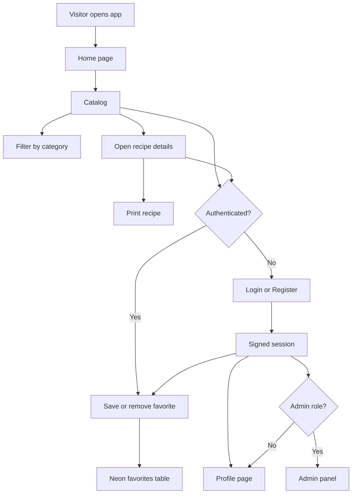
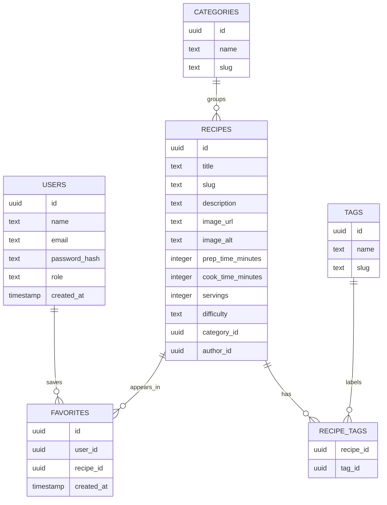

# 🍽️ Chefo’s Recipes

<p>
  <a href="https://chefos-recipes.netlify.app">
    
  </a>
  <a href="https://chefos-recipes-mobile.netlify.app">
    
  </a>
</p>

[](https://nextjs.org/)
[](https://react.dev/)
[](https://www.typescriptlang.org/)
[](https://tailwindcss.com/)
[](https://neon.tech/)
[](https://orm.drizzle.team/)
[](https://expo.dev/)
[](https://www.netlify.com/)
[](#project-status)

**Chefo’s Recipes** is a full-stack Bulgarian recipe catalog built with **Next.js**, **React**, **TypeScript**, **Neon PostgreSQL**, **Drizzle ORM** and **Expo React Native**.

The project includes a deployed **Next.js web app + backend**, a deployed **Expo mobile web export**, real authentication, user-specific favorites, role-based admin access, seeded database content and REST API endpoints used by the mobile client.

This repository was developed as a SoftUni **Full Stack Apps with AI** capstone project and is structured as a production-style npm workspace monorepo.

---

## 🌐 Live Demo

| Platform | URL |
|---|---|
| Web App + Backend API | https://chefos-recipes.netlify.app |
| Expo Mobile Web Export | https://chefos-recipes-mobile.netlify.app |
| GitHub Repository | https://github.com/s-badev/chefos-recipes-fullstack |

---

## 🔑 Review Access

Demo accounts are available for reviewer testing.

| Role | Email | Password | What you can test |
|---|---|---|---|
| User | `user@chefos-recipes.bg` | `user12345` | Catalog, recipe details, favorites and profile |
| Admin | `admin@chefos-recipes.bg` | `admin12345` | Full user access + protected admin panel |

Regular users do **not** see the Admin navigation item and should not be able to access admin-only areas manually.

---

## ✨ Highlights

- 🍲 **Bulgarian recipe catalog** with home-style meals, real images, timing, servings, tags and difficulty levels.
- 🗂️ **24 visible curated recipes** organized across 6 categories.
- 🔎 **Public browsing experience** with home page, catalog, category filtering and recipe details.
- ❤️ **Real user favorites** stored in Neon PostgreSQL.
- 🔐 **Registration and login** with hashed passwords and signed sessions.
- 👋 **Personalized user experience** with user name in header and profile page.
- 🛡️ **Role-based access** with protected admin-only pages.
- 🧑‍🍳 **Admin panel** with complete 24-recipe management list, edit/delete actions and add recipe entry points.
- 🖨️ **Printable recipes** through browser print preview.
- 🗄️ **Neon PostgreSQL + Drizzle ORM** database layer.
- 🌱 **Seed and scalability logic** with curated recipes plus 10,000 generated records for pagination/scalability testing.
- 📱 **Expo React Native mobile app** deployed as web export.
- 🔌 **REST API endpoints** used by the mobile client.
- 🌍 **Netlify deployment** for both web/backend and mobile web export.

---

## 🧭 Application Flow


```mermaid
flowchart TD
  A[Visitor opens app] --> B[Home page]
  B --> C[Catalog]
  C --> D[Filter by category]
  C --> E[Open recipe details]
  E --> F[Print recipe]
  C --> G{Authenticated?}
  E --> G
  G -- No --> H[Login or Register]
  H --> I[Signed session]
  G -- Yes --> J[Save or remove favorite]
  I --> J
  J --> K[Neon favorites table]
  I --> L[Profile page]
  I --> M{Admin role?}
  M -- Yes --> N[Admin panel]
  M -- No --> L
```

---

## 📋 Project Description

**Chefo’s Recipes** focuses on practical Bulgarian home cooking.

The web app provides a curated catalog with rich recipe cards, detailed recipe pages, favorites, authentication and admin management. The mobile app consumes the deployed REST API and provides a mobile-first recipe browsing experience through Expo.

The user-facing UI is Bulgarian-first, while the codebase and documentation remain English-friendly for technical review.

---

## 🖥️ Implemented Web Screens

- Home
- Catalog
- Recipe details
- Favorites
- Profile
- Login
- Register
- About
- Admin dashboard
- Admin recipe management
- Add recipe page
- Edit recipe page

---

## 📱 Implemented Mobile Screens

The Expo mobile app is included under `apps/mobile` and is deployed as a web export.

- Home
- Catalog
- Recipe details
- Favorites
- Login
- Register
- Profile

Mobile deployment:

```text
https://chefos-recipes-mobile.netlify.app
```

The mobile app connects to the deployed Next.js REST API:

```text
https://chefos-recipes.netlify.app/api/mobile
```

---

## 🚀 Key Features

### 🍲 Recipe Catalog

- 24 visible curated recipes in the main catalog
- 6 recipe categories
- Category filtering
- Recipe cards with images, category badges and difficulty badges
- Prep time, cook time, servings and tags
- Save/remove favorite action for authenticated users

### 🧑‍🍳 Recipe Details

- Dedicated detail page for each visible recipe
- Recipe image, title, description and cooking metadata
- Products / ingredients list
- Step-by-step preparation instructions
- Working **“Запази в любими”** action
- Working **“Принтирай рецепта”** action using browser print

### 🔐 Authentication

- User registration persists users in Neon PostgreSQL
- Passwords are hashed with `scrypt`
- Login works for demo accounts and registered users
- Signed session flow with HTTP-only session cookie
- Header displays the logged-in user’s name
- Profile page displays personalized user information

### ❤️ Favorites

- Favorites are stored in Neon PostgreSQL
- Favorites are user-specific
- Users can add and remove favorites from catalog, detail and favorites pages
- Favorite records are linked to users and recipe slugs/IDs

### 🛡️ Admin Panel

- Admin role exists
- Admin navigation is visible only for admin users
- Admin dashboard shows catalog statistics
- Admin panel displays all 24 visible recipes
- Admin can access edit/delete actions
- Admin panel includes add recipe entry points at the top and bottom of the management list

### 🌱 Seed and Scalability

- Seed script lives in `packages/db`
- Core visible recipes are upserted by slug
- Categories and tags are seeded
- 10,000 generated recipe records support scalability testing
- API supports pagination for large datasets

---

## 🗂️ Recipe Categories

| Category | Visible recipes |
|---|---:|
| Салати | 4 |
| Тестени | 4 |
| Основни | 4 |
| Супи | 4 |
| Бързи ястия | 4 |
| Десерти | 4 |
| **Total** | **24** |

---

## 👤 User Roles

| Role | Access |
|---|---|
| Visitor | Home, catalog, recipe details, login and registration |
| User | Visitor access plus profile and user-specific favorites |
| Admin | User access plus protected admin panel and recipe management |

---

## 🏗️ Architecture

```text
chefos-recipes-fullstack/
|-- apps/
|   |-- web/
|   |   |-- src/app/              # Next.js App Router pages and API routes
|   |   |-- src/data/             # Curated visible catalog data
|   |   |-- src/server/           # Auth, favorites and server-side logic
|   |   |-- src/lib/              # Shared app utilities such as CORS helpers
|   |   `-- public/images/        # Recipe and background assets
|   |
|   `-- mobile/
|       |-- src/screens/          # Expo mobile screens
|       |-- src/components/       # Mobile UI components
|       |-- src/services/         # Mobile API client
|       |-- src/context/          # Auth/session context
|       `-- App.tsx               # Expo app root
|
|-- packages/
|   |-- db/                       # Drizzle schema, migrations and seed script
|   `-- shared/                   # Shared TypeScript utilities/types
|
|-- docs/
|-- AGENTS.md
|-- README.md
`-- package.json
```

---

## 🧰 Technology Stack

| Layer | Technology |
|---|---|
| Web framework | Next.js App Router |
| UI | React, TypeScript, Tailwind CSS and global CSS |
| Backend | Next.js route handlers and server-side logic |
| Mobile | Expo React Native, React Native Web |
| Database | Neon PostgreSQL |
| ORM | Drizzle ORM |
| Authentication | `scrypt` password hashing, signed sessions, HTTP-only cookies |
| Deployment | Netlify |
| Package management | Node.js and npm workspaces |

---

## 🔌 API Overview

The mobile client uses REST API endpoints from the deployed Next.js app.

| Endpoint | Purpose |
|---|---|
| `/api/mobile/health` | Mobile API health check |
| `/api/mobile/categories` | Category listing |
| `/api/mobile/recipes` | Paginated recipe catalog |
| `/api/mobile/recipes/[slug]` | Recipe details |
| `/api/mobile/auth/login` | Mobile login |
| `/api/mobile/auth/register` | Mobile registration |
| `/api/mobile/auth/me` | Current authenticated user |
| `/api/mobile/favorites` | User favorites |
| `/api/mobile/favorites/[slug]` | Remove favorite by recipe slug |

The deployed mobile app calls:

```text
https://chefos-recipes.netlify.app/api/mobile
```

CORS support is enabled for the mobile web export deployment.

---

## 🔐 Authentication and Authorization

Authentication is implemented with database-backed users and signed sessions.

- Registered users are stored in the Neon `users` table.
- Passwords are stored as hashes, not plaintext.
- Password hashing uses `scrypt`.
- Login supports demo accounts and registered database users.
- Sessions are signed and stored in an HTTP-only cookie.
- The `role` field supports `user` and `admin`.
- Regular users can access profile and favorites.
- Admin users can access the admin panel.

Secrets are configured through environment variables and are not committed.

---

## ❤️ Favorites

Favorites are real database-backed records.

- A favorite links a user to a recipe.
- Recipe matching uses stable slugs.
- The visible catalog slugs match the seeded Neon recipe slugs.
- Each user sees only their own saved recipes.
- Save/remove is supported from catalog cards, recipe detail pages and the favorites page.

---

## 🗃️ Database Schema Design


```mermaid
erDiagram
  USERS ||--o{ FAVORITES : saves
  RECIPES ||--o{ FAVORITES : appears_in
  CATEGORIES ||--o{ RECIPES : groups
  RECIPES ||--o{ RECIPE_TAGS : has
  TAGS ||--o{ RECIPE_TAGS : labels

  USERS {
    uuid id
    text name
    text email
    text password_hash
    text role
    timestamp created_at
  }

  CATEGORIES {
    uuid id
    text name
    text slug
  }

  RECIPES {
    uuid id
    text title
    text slug
    text description
    text image_url
    text image_alt
    integer prep_time_minutes
    integer cook_time_minutes
    integer servings
    text difficulty
    uuid category_id
    uuid author_id
  }

  FAVORITES {
    uuid id
    uuid user_id
    uuid recipe_id
    timestamp created_at
  }

  TAGS {
    uuid id
    text name
    text slug
  }

  RECIPE_TAGS {
    uuid recipe_id
    uuid tag_id
  }
```

---

## 📈 Seed and Scalability

Run the seed script:

```powershell
npm.cmd run seed --workspace packages/db
```

Seed behavior:

- Upserts the core visible recipes by stable slug.
- Inserts or upserts required categories and tags.
- Keeps the visible catalog compatible with favorites.
- Generates 10,000 additional recipe records for scalability testing.
- Uses generated records without replacing the curated visible catalog.
- Supports pagination tests with large record counts.

---

## 🖼️ Assets

| Asset type | Location |
|---|---|
| Recipe images | `apps/web/public/images/recipes` |
| Background images | `apps/web/public/images/backgrounds` |

---

## 🚀 Local Development Setup

Install dependencies:

```powershell
npm install
```

Start the web app:

```powershell
npm.cmd run dev --workspace apps/web
```

Build the web app:

```powershell
npm.cmd run build --workspace apps/web
```

Seed the database:

```powershell
npm.cmd run seed --workspace packages/db
```

Start the Expo mobile app locally:

```powershell
cd apps/mobile
npx expo start --clear --lan
```

Build the Expo mobile web export:

```powershell
npm.cmd run build --workspace @chefos/mobile
```

---

## 🔧 Environment Variables

### Web / Backend

Required for the deployed Next.js app:

```env
DATABASE_URL=
JWT_TOKEN=
JWT_SECRET=
```

`DATABASE_URL` should point to the Neon PostgreSQL production database.

`JWT_TOKEN` / `JWT_SECRET` should be long random secret values configured in the hosting provider.

### Mobile Web Export

Required for the Expo mobile web export:

```env
EXPO_PUBLIC_API_BASE_URL=https://chefos-recipes.netlify.app
```

The mobile app does not connect directly to the database. It communicates with the REST API exposed by the deployed Next.js app.

---

## 🌍 Deployment

### Web App + Backend

| Setting | Value |
|---|---|
| Platform | Netlify |
| Project name | `chefos-recipes` |
| Live URL | https://chefos-recipes.netlify.app |
| Project to deploy | `apps/web` |
| Build command | `npm --workspace @chefos/web run build` |
| Publish directory | `apps/web/.next` |
| Database | Neon PostgreSQL |
| Required env vars | `DATABASE_URL`, `JWT_TOKEN`, `JWT_SECRET` |

### Expo Mobile Web Export

| Setting | Value |
|---|---|
| Platform | Netlify |
| Project name | `chefos-recipes-mobile` |
| Live URL | https://chefos-recipes-mobile.netlify.app |
| Project to deploy | `apps/mobile` |
| Build command | `npm --workspace @chefos/mobile run build` |
| Publish directory | `apps/mobile/dist` |
| Required env var | `EXPO_PUBLIC_API_BASE_URL=https://chefos-recipes.netlify.app` |

---

## 🧪 Quick Test Guide

1. Open the deployed web app:

   ```text
   https://chefos-recipes.netlify.app
   ```

2. Open the deployed mobile web export:

   ```text
   https://chefos-recipes-mobile.netlify.app
   ```

3. Confirm the live mobile API returns JSON:

   ```text
   https://chefos-recipes.netlify.app/api/mobile/recipes
   ```

4. Log in as a regular user:

   ```text
   user@chefos-recipes.bg
   user12345
   ```

5. Save and remove a recipe from favorites.

6. Log in as admin:

   ```text
   admin@chefos-recipes.bg
   admin12345
   ```

7. Open `/admin` and confirm:
   - total recipes: 24
   - categories: 6
   - tags: 31
   - all 24 recipes are listed
   - edit/delete actions are visible
   - add recipe action is available

8. Open the Expo mobile web export and confirm:
   - home screen loads
   - catalog loads
   - category filtering works
   - recipe details open
   - login/profile/favorites screens are available

---

## ✅ Project Status

| Item | Status |
|---|---|
| Next.js web app | Done |
| Backend API | Done |
| Bulgarian recipe catalog | Done |
| 24 visible curated recipes | Done |
| Category filtering | Done |
| Recipe detail pages | Done |
| Print recipe action | Done |
| Registration and login | Done |
| Hashed passwords | Done |
| Signed sessions | Done |
| User-specific favorites | Done |
| Admin role and admin panel | Done |
| Full admin recipe management list | Done |
| Neon PostgreSQL integration | Done |
| Drizzle ORM schema/seed | Done |
| 10,000 generated records for scalability | Done |
| Expo mobile app | Done |
| Expo mobile web export deployment | Done |
| CORS support for mobile API calls | Done |
| Netlify web/backend deployment | Done |
| Netlify mobile deployment | Done |

---

## 🧾 Submission Information

| Field | Value |
|---|---|
| Project | Chefo’s Recipes |
| Type | Full-stack recipe catalog with web and mobile client |
| Author | Stefan Badev |
| Email | stefan.badev@yahoo.com |
| GitHub Repo | https://github.com/s-badev/chefos-recipes-fullstack |
| Web Project Live URL | https://chefos-recipes.netlify.app |
| Expo Project Live URL | https://chefos-recipes-mobile.netlify.app |
| Database | Neon PostgreSQL with Drizzle ORM |
| Deployment | Netlify |
| Stable tag | `stable-web-mobile-deployed` |

---

## ⚠️ Notes

- The Expo mobile app is deployed as a web export, as required for the project submission.
- The mobile web export uses the deployed Next.js REST API.
- Browser print previews may show browser-generated headers and footers unless disabled in browser print settings.
- This project is built for capstone evaluation and portfolio presentation, not as a hardened commercial SaaS product.

---

## 🎯 Conclusion

Chefo’s Recipes is a deployed full-stack Bulgarian recipe catalog with a working Next.js web app, backend API, Neon PostgreSQL database, Drizzle ORM integration, authentication, favorites, admin access and Expo mobile web export.

The project demonstrates a complete full-stack workflow: database modeling, seeding, backend API design, web UI, mobile UI, authentication, role-based access, deployment and AI-assisted development.

Built by **Stefan Badev** as a portfolio-ready full-stack application.
